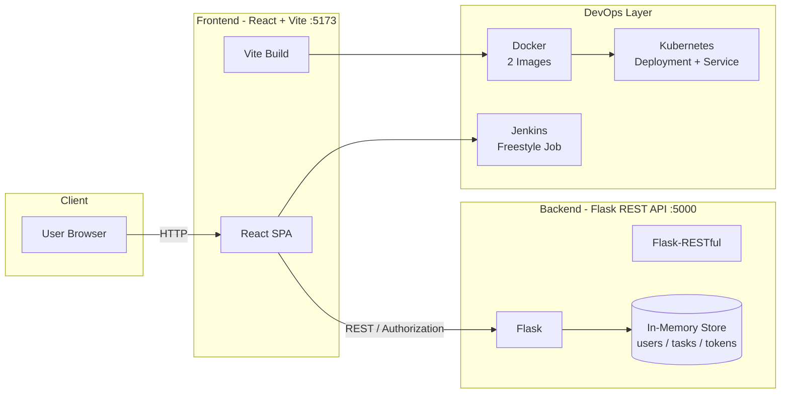

<div align="center">

# Task Manager Web App

**A production-ready, full-stack task management platform — containerized, orchestrated & automated.**

*DevOps Lab Project • Flask • React • Docker • Kubernetes • Jenkins*

<br/>

[](https://www.python.org/)
[](https://flask.palletsprojects.com/)
[](https://react.dev/)
[](https://vitejs.dev/)
[](https://www.docker.com/)
[](https://minikube.sigs.k8s.io/)
[](https://www.jenkins.io/)
[](#license)

[Features](#-features) • [Architecture](#-architecture) • [Quick Start](#-quick-start) • [Docker](#-docker) • [Kubernetes](#-kubernetes--minikube) • [Jenkins CI](#-cicd--jenkins-automation)

</div>

---

## 📖 Overview

**Task Manager Web App** is a full-stack application for secure task management with a clean separation of concerns:

- **Backend** — Flask REST API with token-based auth, in-memory store (zero DB setup)
- **Frontend** — React + Vite SPA with hot-reload, auth flow & task CRUD

The project was built as a **DevOps Lab** exercise to demonstrate the complete lifecycle: **Code → Build → Containerize → Orchestrate → Automate**.

> This repository covers every lab milestone — from local development to Docker images, Kubernetes deployment on Minikube, and Jenkins build automation.

---

## 📑 Table of Contents

- [Features](#-features)
- [Architecture](#-architecture)
- [Tech Stack](#-tech-stack)
- [Project Structure](#-project-structure)
- [API Reference](#-api-reference)
- [Quick Start](#-quick-start)
- [Docker](#-docker)
- [Kubernetes — Minikube](#-kubernetes--minikube)
- [CI/CD — Jenkins Automation](#-cicd--jenkins-automation)
- [DevOps Journey](#-devops-journey--lab-coverage)
- [Troubleshooting & Operations](#-troubleshooting--operations)
- [License](#-license)

---

## ✨ Features

| Area | Highlights |
| :--- | :--- |
| 🔐 **Authentication** | Register & Login with `secrets.token_hex` — token stored in `localStorage`, sent as `Authorization` header |
| ✅ **Task CRUD** | Create, list, retrieve & delete tasks — all protected endpoints |
| ⚡ **Modern Frontend** | React 18 + Vite 5 — instant HMR, optimized production build to `dist/` |
| 🐍 **Lightweight Backend** | Flask + Flask-RESTful + Flask-CORS — no database, in-memory `users / tasks / tokens` |
| 🐳 **Containerized** | Two dedicated images — `task-backend` (Python 3.12) & `task-frontend` (Node 20) |
| ☸️ **Orchestrated** | Single Pod with 2 containers, 2 replicas, NodePort Service — `imagePullPolicy: Never` for Minikube |
| 🤖 **Automated** | Jenkins Freestyle job — `npm install` → `npm run build` with SUCCESS/FAILURE |

---

## 🏗️ Architecture



**Request flow:**

```
Browser → React (Vite :5173) → Authorization: <token> → Flask API (:5000) → In-Memory Store
                              ↘ Vite Build (dist/) → Docker Image → Minikube Pod → NodePort Service → Public URL
```

**Jenkins flow:**

```
GitHub → Checkout → npm install → npm run build → SUCCESS / FAILURE
```

---

## 🧰 Tech Stack

| Layer | Technology | Version / Detail |
| :--- | :--- | :--- |
| **Backend** | Python | 3.12 |
| | Flask | 3.1.1 |
| | Flask-RESTful | 0.3.10 |
| | Flask-Cors | 6.0.1 |
| **Frontend** | React | 18.3.1 |
| | Vite | 5.4.11 |
| | @vitejs/plugin-react | 4.3.4 |
| | CSS3 | Custom, no framework |
| **Tooling** | Node.js | 20 (Docker) |
| | npm | Package & build runner |
| **DevOps** | Docker | Multi-image (backend + frontend) |
| | Kubernetes | Minikube, Deployment + NodePort Service |
| | Jenkins | Freestyle Project, Shell build step |

---

## 📁 Project Structure

```
.
├── main.py                 # Flask REST API — auth + task resources
├── requirements.txt        # Python dependencies
├── package.json            # Node dependencies & scripts
├── vite.config.js          # Vite + React plugin
├── index.html              # SPA entry HTML
├── Dockerfile.backend      # Python 3.12 → Flask on :5000
├── Dockerfile.frontend     # Node 20 → Vite dev server on :5173
├── deployment.yaml         # K8s Deployment — 2 replicas, 2 containers
├── service.yaml            # K8s NodePort Service — exposes 5000 & 5173
├── .dockerignore
├── .gitignore
└── src/                    # React frontend
    ├── main.jsx            # React entry point
    ├── App.jsx             # Root + routing
    ├── App.css             # Global styles
    ├── components/
    │   ├── Login.jsx
    │   ├── Register.jsx
    │   ├── Navbar.jsx
    │   ├── TaskForm.jsx
    │   └── TaskList.jsx
    └── services/
        └── api.js          # API client & auth helpers
```

---

## 🔌 API Reference

Base URL: `http://127.0.0.1:5000` — override with `VITE_API_URL` env variable.

| Method | Endpoint | Auth | Description |
| :----: | :--- | :--: | :--- |
| `POST` | `/register` | — | Register a new user `{username, password}` → `201` |
| `POST` | `/login` | — | Login → `{token}` → `200` · `401` on failure |
| `GET` | `/task` | ✅ | List all tasks |
| `POST` | `/task` | ✅ | Create task `{title, description}` → `201` |
| `GET` | `/task/<id>` | ✅ | Retrieve single task → `200` · `404` |
| `DELETE` | `/task/<id>` | ✅ | Delete task → `200` |

> **Auth:** Token from `/login` is stored in `localStorage` and sent as `Authorization: <token>` header on every protected request.

<details>
<summary><b>Example — cURL</b></summary>

```bash
# Register
curl -X POST http://127.0.0.1:5000/register \
  -H "Content-Type: application/json" \
  -d '{"username":"alice","password":"secret"}'

# Login
curl -X POST http://127.0.0.1:5000/login \
  -H "Content-Type: application/json" \
  -d '{"username":"alice","password":"secret"}'
# → {"token":"a1b2c3..."}

# Create Task
curl -X POST http://127.0.0.1:5000/task \
  -H "Authorization: <token>" \
  -H "Content-Type: application/json" \
  -d '{"title":"Lab Report","description":"Finish DevOps README"}'

# List Tasks
curl http://127.0.0.1:5000/task -H "Authorization: <token>"
```

</details>

---

## 🚀 Quick Start

### Prerequisites

- Python 3.10+ · Node 18+ · npm 9+ · Docker & Minikube (for container/orchestration labs) · Jenkins (for CI lab)

### 1. Backend — Flask API

```bash
python3 -m venv venv
source venv/bin/activate          # Windows: venv\Scripts\activate
pip install -r requirements.txt
python main.py
# → http://127.0.0.1:5000
```

### 2. Frontend — React (Development)

```bash
npm install
npm run dev
# → http://localhost:5173  (HMR + proxy to Flask)
```

### 3. Production Build

```bash
npm run build        # → dist/
npm run preview      # preview production bundle locally
```

---

## 🐳 Docker

Two isolated, reproducible images — one per tier.

| Image | Dockerfile | Base | Port | Command |
| :--- | :--- | :--- | :--: | :--- |
| `task-backend` | `Dockerfile.backend` | `python:3.12` | `5000` | `python main.py` |
| `task-frontend` | `Dockerfile.frontend` | `node:20` | `5173` | `npm run dev -- --host 0.0.0.0` |

```bash
# Build
docker build -t task-backend -f Dockerfile.backend .
docker build -t task-frontend -f Dockerfile.frontend .

# Run (detached)
docker run -d -p 5000:5000 --name backend task-backend
docker run -d -p 5173:5173 --name frontend task-frontend

# Verify
docker ps
docker logs backend
docker logs frontend
```

> `.dockerignore` keeps images lean by excluding `venv/`, `node_modules/`, `dist/`, etc.

---

## ☸️ Kubernetes — Minikube

Deploys both images as **a single Pod with 2 containers**, managed by a Deployment and exposed via a NodePort Service.

### Objects

| Object | File | Name | Key Spec |
| :--- | :--- | :--- | :--- |
| **Deployment** | `deployment.yaml` | `33351-taskmanager-deployment` | `replicas: 2` · containers `task-backend` & `task-frontend` · `imagePullPolicy: Never` |
| **Service** | `service.yaml` | `task-manager-service` | `type: NodePort` · `frontend 5173:5173` · `backend 5000:5000` · selector `app: task-manager` |

### Setup

```bash
# 1. Start cluster
minikube start
minikube status

# 2. Build images (from project root)
docker build -t task-backend -f Dockerfile.backend .
docker build -t task-frontend -f Dockerfile.frontend .

# 3. Load into Minikube (required — imagePullPolicy: Never)
minikube image load task-backend:latest
minikube image load task-frontend:latest
minikube image ls | grep task
```

### Apply Manifests

```bash
kubectl apply -f deployment.yaml
kubectl apply -f service.yaml
```

### Inspect

```bash
kubectl get deployments
kubectl get pods
kubectl get replicasets
kubectl get services          # alias: kubectl get svc
kubectl get all
kubectl get nodes

# Detail
kubectl describe deployment 33351-taskmanager-deployment
kubectl describe pod <pod-name>
kubectl describe svc task-manager-service

# Logs (pod holds both containers)
kubectl logs <pod-name> -c task-backend
kubectl logs <pod-name> -c task-frontend

# Rollout
kubectl rollout status deployment/33351-taskmanager-deployment
kubectl rollout history deployment/33351-taskmanager-deployment
```

### Access

```bash
minikube service task-manager-service              # opens in browser
minikube service task-manager-service --url        # prints URLs
```

Example (Minikube IP `192.168.49.2`):

- Frontend → `http://192.168.49.2:30723`
- Backend → `http://192.168.49.2:32478`

> NodePorts are dynamic — always confirm with `kubectl get svc`.

### Scaling

```bash
kubectl scale deployment 33351-taskmanager-deployment --replicas=4  # up
kubectl scale deployment 33351-taskmanager-deployment --replicas=1  # down
kubectl scale deployment 33351-taskmanager-deployment --replicas=0  # stop
kubectl get pods && kubectl get deployments
```

Or edit `replicas` in `deployment.yaml` and re-apply: `kubectl apply -f deployment.yaml`.

### Cleanup

```bash
kubectl delete -f service.yaml
kubectl delete -f deployment.yaml
minikube stop
# minikube delete  # full reset if needed
```

---

## 🔄 CI/CD — Jenkins Automation

**Goal:** Automate the frontend production build on every push.

```
GitHub → Jenkins Freestyle Job → Checkout → npm install → npm run build → SUCCESS / FAILURE
```

Jenkins needs only **Node.js + npm** — the Flask backend does *not* need to run during the build.

### Freestyle Project Configuration

1. **Source Code Management** → Git → Repository URL: `https://github.com/rekdfr/Task-Manager-Web-App.git` → Branch: `*/main`
2. **Build Triggers** *(optional)* → Poll SCM or GitHub hook trigger
3. **Build** → Execute Shell:

```bash
npm install
npm run build
```

4. **Post-build** → Archive or verify `dist/` exists.

A green **SUCCESS** means checkout, dependency install, and Vite build all passed. A red **FAILURE** points to dependency or build errors — check **Console Output**.

> The build is fully frontend-independent — pure `npm` — showcasing clean separation for CI.

---

## 🧭 DevOps Journey — Lab Coverage

| # | Lab | What Was Done | Artifacts |
| :-: | :--- | :--- | :--- |
| 1 | **App Development** | Flask REST API + React SPA with token auth & in-memory store | `main.py`, `src/` |
| 2 | **Build Automation** | Vite production build via `npm run build` | `vite.config.js`, `dist/` |
| 3 | **CI — Jenkins** | Freestyle job automating `npm install` & `build` | Jenkins config, build history |
| 4 | **Containerization** | Two Dockerfiles — backend (Python) & frontend (Node) | `Dockerfile.backend`, `Dockerfile.frontend`, `.dockerignore` |
| 5 | **Orchestration** | Minikube Deployment (2 replicas, 2 containers) + NodePort Service | `deployment.yaml`, `service.yaml` |
| 6 | **Operations** | Scaling, rollout, logs, describe, events & cleanup workflows | `kubectl` commands above |

Each stage is independently verifiable and documented above — from `python main.py` to `minikube service`.

---

## 🛠️ Troubleshooting & Operations

<details>
<summary><b>ImagePullBackOff / ErrImagePull on Minikube</b></summary>

```bash
# Force local images
kubectl patch deployment 33351-taskmanager-deployment -p \
  '{"spec":{"template":{"spec":{"containers":[{"name":"task-backend","imagePullPolicy":"Never"},{"name":"task-frontend","imagePullPolicy":"Never"}]}}}}'

# Re-load images
minikube image load task-backend:latest
minikube image load task-frontend:latest
kubectl rollout restart deployment/33351-taskmanager-deployment
```

</details>

<details>
<summary><b>Port already in use</b></summary>

```bash
lsof -i :5000 && lsof -i :5173
docker ps   # check running containers
# kill or docker stop <name>
```

</details>

<details>
<summary><b>Inspect cluster events</b></summary>

```bash
kubectl get events --sort-by=.metadata.creationTimestamp
kubectl describe pod <pod-name>
kubectl logs <pod-name> -c task-backend --previous
```

</details>

---

## 📄 License

This project is for **educational / lab purposes**. Feel free to fork, extend, and adapt.

---

<div align="center">

**Built with ♥ for the DevOps Lab**

*Code. Containerize. Orchestrate. Automate.*

[⬆ Back to Top](#task-manager-web-app)

</div>
